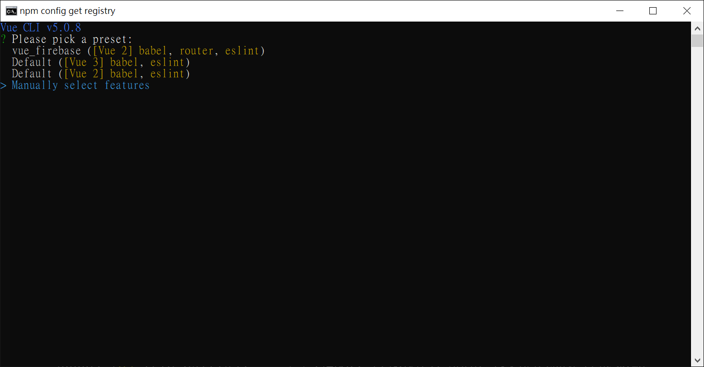
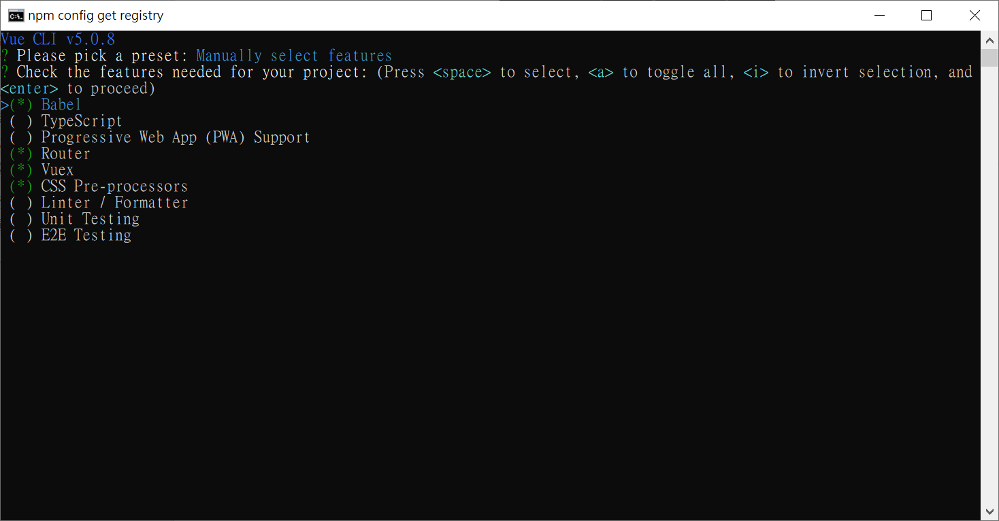
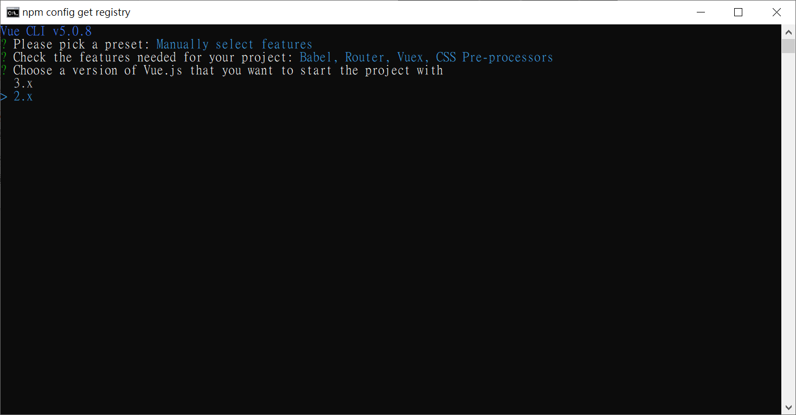
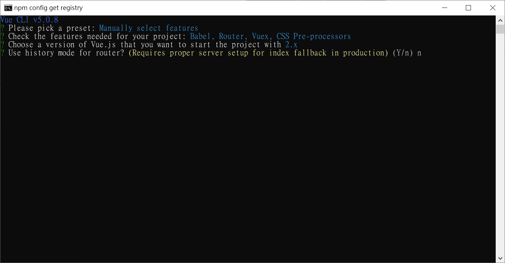
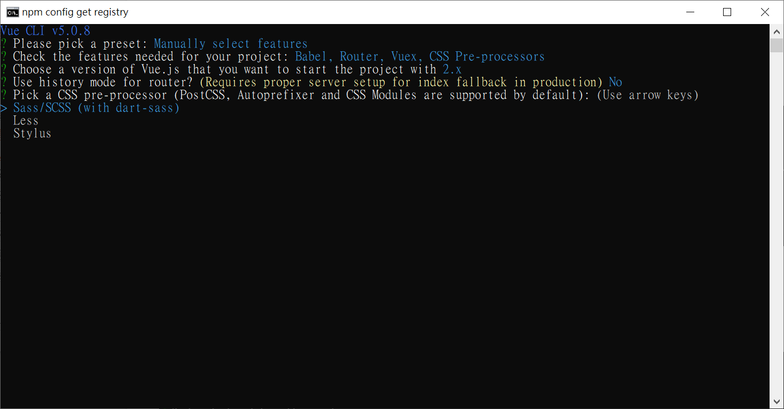
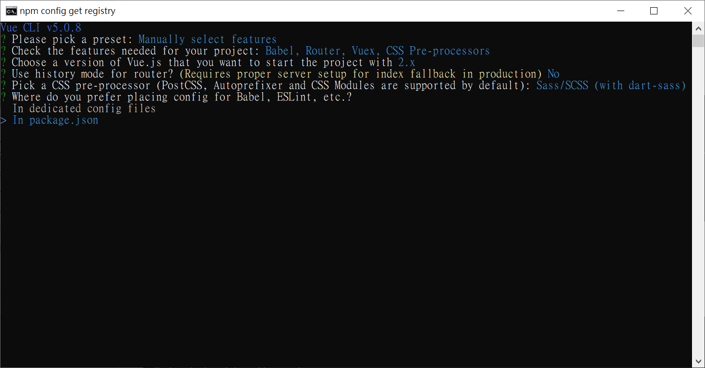
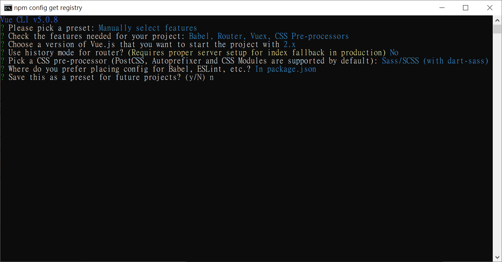
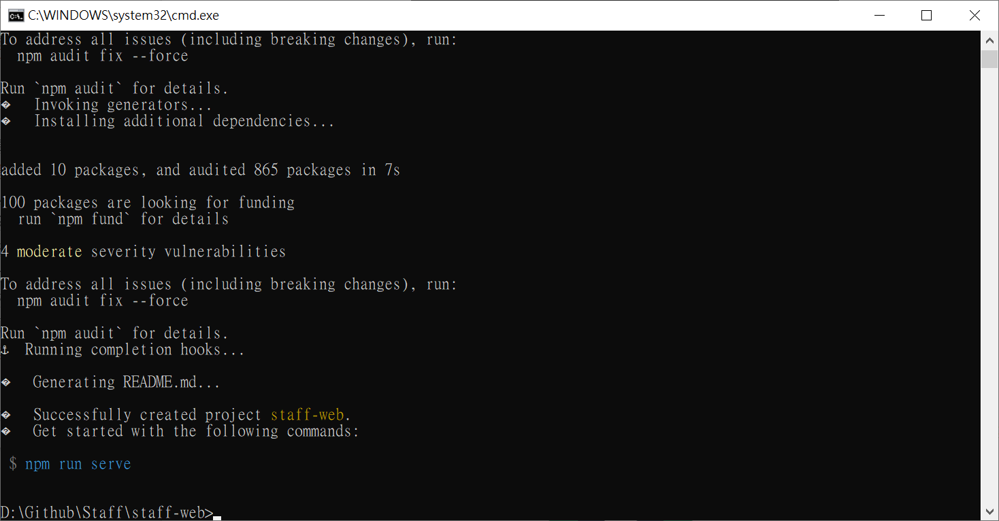

1. 安裝 Vue CLI
    * 安裝 Vue CLI npm install -g @vue/cli
    * 使用 vue create [專案名稱] 或 vue create .
    * 選擇手動建立專案 (Manually select features)

2. 套件選用 Babel、Vuex、CSS Pre-processors

3. Vue版本，選擇2

4. Vue-Router為了讓在網址上會多出#，輸入n

5. 選擇Sass/SCSS

6. 存檔在 package.json

7. 不要儲存相關設定

8. 安裝完成

## 參考
* https://hsuchihting.github.io/vue-js/20200404/497821688/
