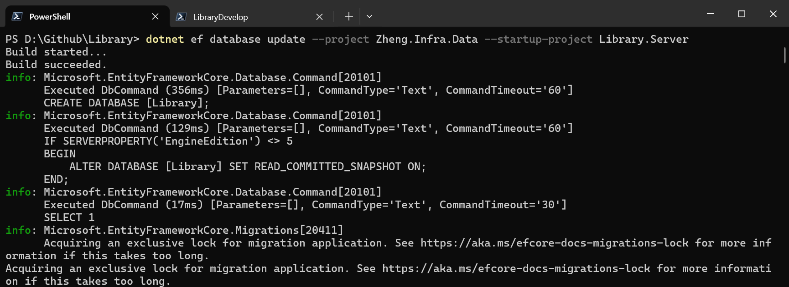

## 前言

EF Core 有兩種開發模式：

| 模式 | 說明 | 適用情境 |
|------|------|---------|
| **Database First** | 先有資料庫，再用 Scaffold 產生程式碼 | 接手既有資料庫、DBA 主導 |
| **Code First** | 先寫 C# Entity，再透過 Migration 建立/更新資料庫 | 新專案、開發者主導 |

**Code First** 的核心流程：

```
定義 Entity → 設定 Fluent API → 建立 DbContext → 產生 Migration → 套用到資料庫
```

本文以 **Library 圖書管理系統** 的真實實作為範例，完整走過 Code First 的每一步。

---

## 專案結構

Library 專案將**資料層**與**應用層**分離：

```
Library/
├── Library.Server/                  ← 啟動專案 (ASP.NET Core Web API)
│   ├── Program.cs                   ← DI 註冊、AddDbContext
│   ├── appsettings.json             ← 連線字串
│   └── Controllers/
│
├── Zheng.Infra.Data/                ← 資料基礎設施層
│   ├── Zheng.Infra.Data.csproj      ← EF Core 套件參考
│   ├── Models/
│   │   ├── LibraryContext.cs        ← DbContext
│   │   ├── User.cs                  ← Entity
│   │   ├── Role.cs
│   │   ├── UserRole.cs
│   │   ├── RolePermission.cs
│   │   ├── Book.cs
│   │   └── Configurations/
│   │       ├── UserConfiguration.cs ← Fluent API (IEntityTypeConfiguration)
│   │       ├── RoleConfiguration.cs
│   │       ├── UserRoleConfiguration.cs
│   │       ├── RolePermissionConfiguration.cs
│   │       └── SeedData.cs          ← 種子資料
│   └── Migrations/
│       ├── 20260411184132_Init.cs
│       ├── 20260411192012_UpdateAdminRoleName.cs
│       └── LibraryContextModelSnapshot.cs
│
└── Zheng.Bll/                       ← 商業邏輯層
    └── Services/
```

**為什麼要拆分？**
- `Zheng.Infra.Data` 專案只包含 Entity、DbContext、Migration，不依賴 ASP.NET Core
- `Library.Server` 是啟動專案，負責 DI 註冊和 Web API
- Migration 指令需要同時指定兩個專案（後面會詳細說明）

---

## Step 1：安裝 NuGet 套件

在資料層專案 `Zheng.Infra.Data.csproj` 中安裝必要套件：

```xml
<Project Sdk="Microsoft.NET.Sdk">

  <PropertyGroup>
    <TargetFramework>net8.0</TargetFramework>
  </PropertyGroup>

  <ItemGroup>
    <PackageReference Include="Microsoft.EntityFrameworkCore.SqlServer" Version="9.0.6" />
    <PackageReference Include="Microsoft.EntityFrameworkCore.Tools" Version="9.0.6">
      <PrivateAssets>all</PrivateAssets>
      <IncludeAssets>runtime; build; native; contentfiles; analyzers; buildtransitive</IncludeAssets>
    </PackageReference>
  </ItemGroup>

</Project>
```

| 套件 | 用途 |
|------|------|
| `EntityFrameworkCore.SqlServer` | SQL Server 資料庫提供者 |
| `EntityFrameworkCore.Tools` | `dotnet ef` CLI 工具支援（加入 Migration、更新資料庫等） |

> **注意：** `Tools` 套件標記為 `PrivateAssets=all`，表示它只在開發時使用，不會被打包到發行版本中。

---

## Step 2：定義 Entity Model

Entity 就是對應資料庫 Table 的 C# 類別。以下是核心的權限相關 Entity：

### User（使用者）

```csharp
// Zheng.Infra.Data/Models/User.cs

using System.ComponentModel.DataAnnotations;
using System.ComponentModel.DataAnnotations.Schema;

namespace Zheng.Infra.Data.Models;

[Table("User")]
public class User
{
    [Key]
    public Guid Id { get; set; }

    [Required]
    [StringLength(256)]
    public string UserName { get; set; } = null!;

    [Required]
    [StringLength(256)]
    public string NormalizedUserName { get; set; } = null!;

    [Required]
    [StringLength(256)]
    public string Email { get; set; } = null!;

    [Required]
    [StringLength(256)]
    public string NormalizedEmail { get; set; } = null!;

    public bool EmailConfirmed { get; set; }

    [StringLength(500)]
    public string? PasswordHash { get; set; }

    public int PasswordHashVersion { get; set; }

    [StringLength(100)]
    public string? SecurityStamp { get; set; }

    [StringLength(50)]
    public string? PhoneNumber { get; set; }

    public bool PhoneNumberConfirmed { get; set; }
    public bool TwoFactorEnabled { get; set; }
    public DateTimeOffset? LockoutEnd { get; set; }
    public bool LockoutEnabled { get; set; }
    public int AccessFailedCount { get; set; }
    public bool IsActive { get; set; }
    public DateTime CreatedAt { get; set; }
    public DateTime? UpdatedAt { get; set; }

    [StringLength(100)]
    public string? ConcurrencyStamp { get; set; }

    // Navigation Properties（導覽屬性）
    public virtual ICollection<UserRole> UserRoles { get; set; } = new List<UserRole>();
    public virtual ICollection<UserExternalLogin> UserExternalLogins { get; set; } = new List<UserExternalLogin>();
    public virtual ICollection<UserToken> UserTokens { get; set; } = new List<UserToken>();
    public virtual ICollection<Loan> Loans { get; set; } = new List<Loan>();
}
```

### Role（角色）

```csharp
// Zheng.Infra.Data/Models/Role.cs

[Table("Role")]
public class Role
{
    [Key]
    public Guid Id { get; set; }

    [Required]
    [StringLength(256)]
    public string Name { get; set; } = null!;

    [Required]
    [StringLength(256)]
    public string NormalizedName { get; set; } = null!;

    [StringLength(500)]
    public string? Description { get; set; }

    [StringLength(100)]
    public string? ConcurrencyStamp { get; set; }

    public DateTime CreatedAt { get; set; }
    public DateTime? UpdatedAt { get; set; }

    // Navigation Properties
    public virtual ICollection<UserRole> UserRoles { get; set; } = new List<UserRole>();
    public virtual ICollection<RolePermission> RolePermissions { get; set; } = new List<RolePermission>();
}
```

### UserRole（使用者-角色 多對多 Join Table）

```csharp
// Zheng.Infra.Data/Models/UserRole.cs

[Table("UserRole")]
public class UserRole
{
    public Guid UserId { get; set; }
    public Guid RoleId { get; set; }
    public DateTime AssignedAt { get; set; }

    [ForeignKey("UserId")]
    public virtual User User { get; set; } = null!;

    [ForeignKey("RoleId")]
    public virtual Role Role { get; set; } = null!;
}
```

### RolePermission（角色-權限）

```csharp
// Zheng.Infra.Data/Models/RolePermission.cs

[Table("RolePermission")]
public class RolePermission
{
    [Key]
    public int Id { get; set; }

    public Guid RoleId { get; set; }

    [Required]
    [StringLength(256)]
    public string Permission { get; set; } = null!;

    [ForeignKey("RoleId")]
    public virtual Role Role { get; set; } = null!;
}
```

### 資料模型關係圖

```
┌──────────┐       ┌──────────────┐       ┌──────────┐       ┌──────────────────┐
│   User   │ 1───N │   UserRole   │ N───1 │   Role   │ 1───N │ RolePermission   │
│          │       │              │       │          │       │                  │
│ Id (PK)  │       │ UserId (FK)  │       │ Id (PK)  │       │ Id (PK)          │
│ UserName │       │ RoleId (FK)  │       │ Name     │       │ RoleId (FK)      │
│ Email    │       │ AssignedAt   │       │ ...      │       │ Permission       │
└──────────┘       └──────────────┘       └──────────┘       └──────────────────┘
                   (Composite PK:                            (Unique: RoleId +
                    UserId + RoleId)                          Permission)
```

**常用 Data Annotation 說明：**

| Attribute | 用途 | 對應 SQL |
|-----------|------|----------|
| `[Table("User")]` | 指定資料表名稱 | `CREATE TABLE [User]` |
| `[Key]` | 主鍵 | `PRIMARY KEY` |
| `[Required]` | 不允許 NULL | `NOT NULL` |
| `[StringLength(256)]` | 最大長度 | `nvarchar(256)` |
| `[ForeignKey("UserId")]` | 外鍵關聯 | `FOREIGN KEY` |

---

## Step 3：Fluent API 設定（IEntityTypeConfiguration）

Data Annotation 適合簡單設定，但**複雜的關聯、索引、預設值**則需要 Fluent API。我們用 `IEntityTypeConfiguration<T>` 將設定與 Entity 分離：

### UserConfiguration

```csharp
// Zheng.Infra.Data/Models/Configurations/UserConfiguration.cs

using Microsoft.EntityFrameworkCore;
using Microsoft.EntityFrameworkCore.Metadata.Builders;

namespace Zheng.Infra.Data.Models.Configurations;

public class UserConfiguration : IEntityTypeConfiguration<User>
{
    public void Configure(EntityTypeBuilder<User> builder)
    {
        // ── 唯一索引 ──
        builder.HasIndex(u => u.NormalizedUserName, "IX_User_NormalizedUserName")
            .IsUnique();

        builder.HasIndex(u => u.NormalizedEmail, "IX_User_NormalizedEmail")
            .IsUnique();

        // ── 預設值 ──
        builder.Property(u => u.EmailConfirmed).HasDefaultValue(false);
        builder.Property(u => u.PasswordHashVersion).HasDefaultValue(2);
        builder.Property(u => u.PhoneNumberConfirmed).HasDefaultValue(false);
        builder.Property(u => u.TwoFactorEnabled).HasDefaultValue(false);
        builder.Property(u => u.LockoutEnabled).HasDefaultValue(true);
        builder.Property(u => u.AccessFailedCount).HasDefaultValue(0);
        builder.Property(u => u.IsActive).HasDefaultValue(true);

        // ── 欄位型別 ──
        builder.Property(u => u.CreatedAt).HasColumnType("datetime2");
        builder.Property(u => u.UpdatedAt).HasColumnType("datetime2");

        // ── 一對多關聯 + Cascade Delete ──
        builder.HasMany(u => u.UserRoles)
            .WithOne(ur => ur.User)
            .HasForeignKey(ur => ur.UserId)
            .OnDelete(DeleteBehavior.Cascade);  // 刪除 User 時連帶刪除 UserRole

        builder.HasMany(u => u.UserExternalLogins)
            .WithOne(uel => uel.User)
            .HasForeignKey(uel => uel.UserId)
            .OnDelete(DeleteBehavior.Cascade);

        builder.HasMany(u => u.UserTokens)
            .WithOne(ut => ut.User)
            .HasForeignKey(ut => ut.UserId)
            .OnDelete(DeleteBehavior.Cascade);
    }
}
```

### RoleConfiguration

```csharp
// Zheng.Infra.Data/Models/Configurations/RoleConfiguration.cs

public class RoleConfiguration : IEntityTypeConfiguration<Role>
{
    public void Configure(EntityTypeBuilder<Role> builder)
    {
        builder.HasIndex(r => r.NormalizedName, "IX_Role_NormalizedName")
            .IsUnique();

        builder.Property(r => r.CreatedAt).HasColumnType("datetime2");
        builder.Property(r => r.UpdatedAt).HasColumnType("datetime2");

        builder.HasMany(r => r.UserRoles)
            .WithOne(ur => ur.Role)
            .HasForeignKey(ur => ur.RoleId)
            .OnDelete(DeleteBehavior.Cascade);

        builder.HasMany(r => r.RolePermissions)
            .WithOne(rp => rp.Role)
            .HasForeignKey(rp => rp.RoleId)
            .OnDelete(DeleteBehavior.Cascade);
    }
}
```

### UserRoleConfiguration（複合主鍵）

```csharp
// Zheng.Infra.Data/Models/Configurations/UserRoleConfiguration.cs

public class UserRoleConfiguration : IEntityTypeConfiguration<UserRole>
{
    public void Configure(EntityTypeBuilder<UserRole> builder)
    {
        // 複合主鍵：UserId + RoleId
        builder.HasKey(ur => new { ur.UserId, ur.RoleId });

        builder.Property(ur => ur.AssignedAt).HasColumnType("datetime2");
    }
}
```

### RolePermissionConfiguration（複合唯一索引）

```csharp
// Zheng.Infra.Data/Models/Configurations/RolePermissionConfiguration.cs

public class RolePermissionConfiguration : IEntityTypeConfiguration<RolePermission>
{
    public void Configure(EntityTypeBuilder<RolePermission> builder)
    {
        // 複合唯一索引：同一角色不能有重複權限
        builder.HasIndex(rp => new { rp.RoleId, rp.Permission },
            "IX_RolePermission_RoleId_Permission").IsUnique();

        builder.HasIndex(rp => rp.RoleId, "IX_RolePermission_RoleId");
    }
}
```

### Data Annotation vs Fluent API 比較

| 功能 | Data Annotation | Fluent API |
|------|----------------|------------|
| 主鍵 | `[Key]` | `builder.HasKey(...)` |
| 必填 | `[Required]` | `builder.Property(...).IsRequired()` |
| 長度 | `[StringLength(256)]` | `builder.Property(...).HasMaxLength(256)` |
| 表名 | `[Table("User")]` | `builder.ToTable("User")` |
| **複合主鍵** | ❌ 不支援 | ✅ `builder.HasKey(x => new { x.A, x.B })` |
| **唯一索引** | ❌ 不支援 | ✅ `builder.HasIndex(...).IsUnique()` |
| **預設值** | ❌ 不支援 | ✅ `builder.Property(...).HasDefaultValue(...)` |
| **Cascade Delete** | ❌ 不支援 | ✅ `builder.HasMany(...).OnDelete(...)` |

> **建議：** 簡單的設定用 Data Annotation（直觀），複雜的關聯和約束用 Fluent API。兩者可以混用。

---

## Step 4：建立 DbContext

`DbContext` 是 EF Core 的核心，代表一個「資料庫連線 Session」：

```csharp
// Zheng.Infra.Data/Models/LibraryContext.cs

using Microsoft.EntityFrameworkCore;
using Zheng.Infra.Data.Models.Configurations;

namespace Zheng.Infra.Data.Models;

public partial class LibraryContext : DbContext
{
    public LibraryContext(DbContextOptions<LibraryContext> options)
        : base(options)
    {
    }

    // ── 身份驗證相關 ──
    public virtual DbSet<User> Users { get; set; }
    public virtual DbSet<Role> Roles { get; set; }
    public virtual DbSet<UserRole> UserRoles { get; set; }
    public virtual DbSet<RolePermission> RolePermissions { get; set; }
    public virtual DbSet<UserExternalLogin> UserExternalLogins { get; set; }
    public virtual DbSet<UserToken> UserTokens { get; set; }

    // ── 業務資料 ──
    public virtual DbSet<Book> Books { get; set; }
    public virtual DbSet<BookPhoto> BookPhotos { get; set; }
    public virtual DbSet<Category> Categories { get; set; }
    public virtual DbSet<Loan> Loans { get; set; }
    public virtual DbSet<SysMenu> SysMenus { get; set; }
    public virtual DbSet<UploadFile> UploadFiles { get; set; }

    protected override void OnModelCreating(ModelBuilder modelBuilder)
    {
        // 1. 套用 Entity 欄位設定（HasComment 等）
        modelBuilder.Entity<Book>(entity =>
        {
            entity.Property(e => e.Id).ValueGeneratedNever().HasComment("系統編號");
            entity.Property(e => e.Title).HasComment("書名標題");
            // ... 其他欄位註解
        });

        // 2. 套用 Fluent API Configuration
        modelBuilder.ApplyConfiguration(new UserConfiguration());
        modelBuilder.ApplyConfiguration(new RoleConfiguration());
        modelBuilder.ApplyConfiguration(new UserRoleConfiguration());
        modelBuilder.ApplyConfiguration(new RolePermissionConfiguration());
        modelBuilder.ApplyConfiguration(new UserExternalLoginConfiguration());
        modelBuilder.ApplyConfiguration(new UserTokenConfiguration());

        // 3. 套用種子資料
        SeedData.Apply(modelBuilder);

        OnModelCreatingPartial(modelBuilder);
    }

    partial void OnModelCreatingPartial(ModelBuilder modelBuilder);
}
```

**重點說明：**

| 項目 | 說明 |
|------|------|
| `DbSet<T>` | 每個 `DbSet` 對應一張資料表，用於 LINQ 查詢和 CRUD |
| `OnModelCreating` | EF Core 建立模型時的 Hook，在這裡設定 Fluent API 和 Seed Data |
| `ApplyConfiguration` | 套用獨立的 `IEntityTypeConfiguration<T>` 設定（職責分離） |
| `partial class` | 允許在其他檔案擴充 DbContext，不修改主檔案 |

---

## Step 5：Seed Data（種子資料）

`SeedData` 用於在 Migration 中自動插入初始資料（如管理員帳號、預設角色等）：

```csharp
// Zheng.Infra.Data/Models/Configurations/SeedData.cs

using Microsoft.EntityFrameworkCore;

namespace Zheng.Infra.Data.Models.Configurations;

public static class SeedData
{
    // 固定 GUID，確保 seed data 可重複執行（冪等）
    public static readonly Guid AdminUserId = new("7101a225-07a0-460c-85c2-9291b0845d81");
    public static readonly Guid AdminRoleId = new("c69cd53c-0ced-4aae-a120-1a7097e43650");

    private static readonly DateTime SeedDate = new(2026, 4, 11, 0, 0, 0, DateTimeKind.Utc);

    // BCrypt hash of "Admin@123" with workFactor 12
    private const string AdminPasswordHash =
        "$2a$12$i0MquD3jv8B8kXLNajHZ7OlndZIXRObDL5Ac1inOez0yLPH56R.g2";

    public static void Apply(ModelBuilder modelBuilder)
    {
        SeedAdminUser(modelBuilder);
        SeedAdminRole(modelBuilder);
        SeedUserRole(modelBuilder);
        SeedRolePermissions(modelBuilder);
        SeedSysMenus(modelBuilder);
    }

    // ── 管理員帳號 ──
    private static void SeedAdminUser(ModelBuilder modelBuilder)
    {
        modelBuilder.Entity<User>().HasData(new User
        {
            Id = AdminUserId,
            UserName = "admin",
            NormalizedUserName = "ADMIN",
            Email = "admin@library.com",
            NormalizedEmail = "ADMIN@LIBRARY.COM",
            EmailConfirmed = true,
            PasswordHash = AdminPasswordHash,
            PasswordHashVersion = 2,       // 2 = BCrypt
            SecurityStamp = "STATIC_SECURITY_STAMP_ADMIN_001",
            PhoneNumberConfirmed = false,
            TwoFactorEnabled = false,
            LockoutEnabled = true,
            AccessFailedCount = 0,
            IsActive = true,
            CreatedAt = SeedDate,
            ConcurrencyStamp = "00000000-0000-0000-0000-000000000001"
        });
    }

    // ── 管理員角色 ──
    private static void SeedAdminRole(ModelBuilder modelBuilder)
    {
        modelBuilder.Entity<Role>().HasData(new Role
        {
            Id = AdminRoleId,
            Name = "系統管理員",
            NormalizedName = "ADMIN",
            Description = "系統管理員",
            CreatedAt = SeedDate,
            ConcurrencyStamp = "00000000-0000-0000-0000-000000000002"
        });
    }

    // ── 指派角色給使用者 ──
    private static void SeedUserRole(ModelBuilder modelBuilder)
    {
        modelBuilder.Entity<UserRole>().HasData(new UserRole
        {
            UserId = AdminUserId,
            RoleId = AdminRoleId,
            AssignedAt = SeedDate
        });
    }

    // ── 角色權限 ──
    private static void SeedRolePermissions(ModelBuilder modelBuilder)
    {
        var permissions = new[]
        {
            "Home", "Management", "Books",
            "Books.View", "Books.Create", "Books.Edit", "Books.Delete",
            "reader", "System", "Menu",
            "System.Menu", "System.Menu.Create", "System.Menu.Update", "System.Menu.Delete",
            "Users", "Users.Create", "Users.Edit", "Users.View", "Users.Delete",
            "Users.ResetPassword",
            "Roles", "Roles.View", "Roles.Create", "Roles.Edit", "Roles.Delete"
        };

        var data = new RolePermission[permissions.Length];
        for (int i = 0; i < permissions.Length; i++)
        {
            data[i] = new RolePermission
            {
                Id = i + 1,            // Id 必須是常數，不能用自增
                RoleId = AdminRoleId,
                Permission = permissions[i]
            };
        }

        modelBuilder.Entity<RolePermission>().HasData(data);
    }

    // ── 系統選單（省略部分內容）──
    private static void SeedSysMenus(ModelBuilder modelBuilder)
    {
        modelBuilder.Entity<SysMenu>().HasData(
            new SysMenu
            {
                Id = 1, ParentModuleId = 0, ModuleNo = "Home",
                Name = "首頁", Url = "/", Icon = "HomeFilled",
                IsMenu = true, IsOpen = false, Hidden = false,
                Levels = 1, SortOrder = 1, Status = true,
                CreatedAt = SeedDate, CreatedBy = AdminUserId
            }
            // ... 其餘 24 筆選單和按鈕權限
        );
    }
}
```

### HasData() 使用重點

| 規則 | 說明 |
|------|------|
| **主鍵必須明確指定** | `Id = AdminUserId`（不能用自動生成） |
| **只能用常數值** | 不能用 `DateTime.Now`、`Guid.NewGuid()` 等動態值 |
| **固定 Guid** | 確保每次執行 Migration 產生相同結果（冪等性） |
| **Navigation Property 不能用** | 要用 FK 值（如 `RoleId = AdminRoleId`），不能設定 `Role = ...` |
| **變更會被追蹤** | 修改 HasData 的值後，新增 Migration 會自動產生 `UpdateData` |

---

## Step 6：連線字串與 DI 註冊

### appsettings.json

```json
{
  "ConnectionStrings": {
    "DefaultConnection": "Data Source=.\\SQLEXPRESS;Initial Catalog=Library;User ID=sa;Password=YourPassword;TrustServerCertificate=True;"
  }
}
```

### Program.cs 註冊 DbContext

```csharp
// Library.Server/Program.cs

using Microsoft.EntityFrameworkCore;
using Zheng.Infra.Data.Models;

var builder = WebApplication.CreateBuilder(args);

// 註冊 EF Core DbContext
builder.Services.AddDbContext<LibraryContext>(options =>
    options.UseSqlServer(
        builder.Configuration.GetConnectionString("DefaultConnection")));
```

`AddDbContext` 預設使用 **Scoped** 生命週期，每個 HTTP Request 共用一個 DbContext 實例。

---

## Step 7：Migration 指令操作

這是 Code First 最重要的部分。因為我們的 **DbContext 在 `Zheng.Infra.Data` 專案**，但**啟動專案是 `Library.Server`**，所以每個指令都需要指定兩個專案：

```
--project Zheng.Infra.Data           ← DbContext 和 Migration 所在的專案
--startup-project Library.Server     ← 啟動專案（讀取 appsettings.json 連線字串）
```

### 首次建立資料庫

```bash
# 1. 產生 Init Migration（在 Zheng.Infra.Data/Migrations/ 下產生檔案）
dotnet ef migrations add Init --project Zheng.Infra.Data --startup-project Library.Server

# 2. 套用 Migration 到資料庫（建立所有 Table + 插入 Seed Data）
dotnet ef database update --project Zheng.Infra.Data --startup-project Library.Server
```



執行後，EF Core 會：
1. 讀取 `LibraryContext` 的所有 `DbSet<T>` 和 `OnModelCreating` 設定
2. 產生 `Migrations/YYYYMMDDHHMMSS_Init.cs` 檔案
3. `database update` 時在 SQL Server 建立所有 Table、Index、FK，並插入 Seed Data

### 刪除資料庫並重建（開發環境）

當你要**從頭來過**（例如 Entity 改太多、想要乾淨的 Migration 歷史）：

```bash
# 1. 強制刪除資料庫
dotnet ef database drop --project Zheng.Infra.Data --startup-project Library.Server --force

# 2. 刪除 Migrations 資料夾中所有檔案（手動或指令）

# 3. 重新產生 Init Migration
dotnet ef migrations add Init --project Zheng.Infra.Data --startup-project Library.Server

# 4. 建立資料庫
dotnet ef database update --project Zheng.Infra.Data --startup-project Library.Server
```

> ⚠️ **警告：** `database drop --force` 會**刪除整個資料庫**，只適合開發環境使用！

### 方式一：新增差異 Migration（推薦，適合正式環境）

當你修改了 Entity、Fluent API 設定、或 SeedData 後，**不需要刪除資料庫**，直接新增一個差異 Migration：

```bash
# EF 會自動比對 Model Snapshot，產生差異 SQL（INSERT/UPDATE/DELETE/ALTER）
dotnet ef migrations add <描述名稱> --project Zheng.Infra.Data --startup-project Library.Server

# 套用到資料庫
dotnet ef database update --project Zheng.Infra.Data --startup-project Library.Server
```

例如：修改 SeedData 中 Admin 角色的名稱從 `"Admin"` 改為 `"系統管理員"`，然後：

```bash
dotnet ef migrations add UpdateAdminRoleName --project Zheng.Infra.Data --startup-project Library.Server
dotnet ef database update --project Zheng.Infra.Data --startup-project Library.Server
```

EF 會自動產生只包含 `UpdateData` 的差異 Migration（見下方實例）。

---

## Step 8：Migration 檔案解析

### Init Migration（首次建立）

`20260411184132_Init.cs` — 此檔案由 EF Core 根據你的 Entity 和 Fluent API 設定自動產生。以下節錄關鍵部分：

#### CreateTable — 建立角色表

```csharp
migrationBuilder.CreateTable(
    name: "Role",
    columns: table => new
    {
        Id = table.Column<Guid>(type: "uniqueidentifier", nullable: false),
        Name = table.Column<string>(type: "nvarchar(256)", maxLength: 256, nullable: false),
        NormalizedName = table.Column<string>(type: "nvarchar(256)", maxLength: 256, nullable: false),
        Description = table.Column<string>(type: "nvarchar(500)", maxLength: 500, nullable: true),
        ConcurrencyStamp = table.Column<string>(type: "nvarchar(100)", maxLength: 100, nullable: true),
        CreatedAt = table.Column<DateTime>(type: "datetime2", nullable: false),
        UpdatedAt = table.Column<DateTime>(type: "datetime2", nullable: true)
    },
    constraints: table =>
    {
        table.PrimaryKey("PK_Role", x => x.Id);
    });
```

#### CreateTable — 建立使用者角色 Join Table（含外鍵 + 複合主鍵）

```csharp
migrationBuilder.CreateTable(
    name: "UserRole",
    columns: table => new
    {
        UserId = table.Column<Guid>(type: "uniqueidentifier", nullable: false),
        RoleId = table.Column<Guid>(type: "uniqueidentifier", nullable: false),
        AssignedAt = table.Column<DateTime>(type: "datetime2", nullable: false)
    },
    constraints: table =>
    {
        table.PrimaryKey("PK_UserRole", x => new { x.UserId, x.RoleId });
        table.ForeignKey(
            name: "FK_UserRole_Role_RoleId",
            column: x => x.RoleId,
            principalTable: "Role",
            principalColumn: "Id",
            onDelete: ReferentialAction.Cascade);
        table.ForeignKey(
            name: "FK_UserRole_User_UserId",
            column: x => x.UserId,
            principalTable: "User",
            principalColumn: "Id",
            onDelete: ReferentialAction.Cascade);
    });
```

#### InsertData — 插入種子資料

```csharp
migrationBuilder.InsertData(
    table: "Role",
    columns: new[] { "Id", "ConcurrencyStamp", "CreatedAt", "Description",
                     "Name", "NormalizedName", "UpdatedAt" },
    values: new object[] {
        new Guid("c69cd53c-0ced-4aae-a120-1a7097e43650"),
        "00000000-0000-0000-0000-000000000002",
        new DateTime(2026, 4, 11, 0, 0, 0, 0, DateTimeKind.Utc),
        "系統管理員", "Admin", "ADMIN", null
    });
```

#### CreateIndex — 建立索引

```csharp
migrationBuilder.CreateIndex(
    name: "IX_Role_NormalizedName",
    table: "Role",
    column: "NormalizedName",
    unique: true);

migrationBuilder.CreateIndex(
    name: "IX_RolePermission_RoleId_Permission",
    table: "RolePermission",
    columns: new[] { "RoleId", "Permission" },
    unique: true);
```

#### Down() — 回滾操作

每個 Migration 都有 `Down()` 方法，用於回滾（反向操作）：

```csharp
protected override void Down(MigrationBuilder migrationBuilder)
{
    migrationBuilder.DropTable(name: "BookPhoto");
    migrationBuilder.DropTable(name: "Loan");
    migrationBuilder.DropTable(name: "RolePermission");
    migrationBuilder.DropTable(name: "UserRole");
    migrationBuilder.DropTable(name: "UserToken");
    migrationBuilder.DropTable(name: "Book");
    migrationBuilder.DropTable(name: "Role");
    migrationBuilder.DropTable(name: "User");
    // ... 刪除所有表（注意順序：先刪有 FK 的子表）
}
```

---

### 差異 Migration 實例一：UpdateAdminRoleName

修改 SeedData 中 Role 的 `Name` 從 `"Admin"` → `"系統管理員"` 後產生的 Migration：

```csharp
// 20260411192012_UpdateAdminRoleName.cs

public partial class UpdateAdminRoleName : Migration
{
    protected override void Up(MigrationBuilder migrationBuilder)
    {
        migrationBuilder.UpdateData(
            table: "Role",
            keyColumn: "Id",
            keyValue: new Guid("c69cd53c-0ced-4aae-a120-1a7097e43650"),
            column: "Name",
            value: "系統管理員");
    }

    protected override void Down(MigrationBuilder migrationBuilder)
    {
        migrationBuilder.UpdateData(
            table: "Role",
            keyColumn: "Id",
            keyValue: new Guid("c69cd53c-0ced-4aae-a120-1a7097e43650"),
            column: "Name",
            value: "Admin");
    }
}
```

**觀察重點：**
- EF Core 自動偵測到 SeedData 中 `Name` 欄位的值改變了
- `Up()` 產生 `UpdateData`，只更新有變動的欄位
- `Down()` 產生反向操作，可以回滾

### 差異 Migration 實例二：UpdateSysMenuIcons

修改 SeedData 中 SysMenu 的 `Icon` 欄位後產生的 Migration：

```csharp
// 20260412063831_UpdateSysMenuIcons.cs

public partial class UpdateSysMenuIcons : Migration
{
    protected override void Up(MigrationBuilder migrationBuilder)
    {
        migrationBuilder.UpdateData(
            table: "SysMenu",
            keyColumn: "Id",
            keyValue: 1L,
            column: "Icon",
            value: "HomeFilled");

        migrationBuilder.UpdateData(
            table: "SysMenu",
            keyColumn: "Id",
            keyValue: 2L,
            column: "Icon",
            value: "Document");

        migrationBuilder.UpdateData(
            table: "SysMenu",
            keyColumn: "Id",
            keyValue: 3L,
            column: "Icon",
            value: "Setting");
    }

    protected override void Down(MigrationBuilder migrationBuilder)
    {
        migrationBuilder.UpdateData(
            table: "SysMenu",
            keyColumn: "Id",
            keyValue: 1L,
            column: "Icon",
            value: null);

        migrationBuilder.UpdateData(
            table: "SysMenu",
            keyColumn: "Id",
            keyValue: 2L,
            column: "Icon",
            value: null);

        migrationBuilder.UpdateData(
            table: "SysMenu",
            keyColumn: "Id",
            keyValue: 3L,
            column: "Icon",
            value: null);
    }
}
```

這就是**差異 Migration 的威力**：你只修改了 SeedData.cs 中的 3 個 Icon 值，EF Core 自動比對 Model Snapshot，只產生這 3 筆 `UpdateData`。

---

## 常見問題 FAQ

### Q1：為什麼 Migration 指令要分 `--project` 和 `--startup-project`？

```
--project Zheng.Infra.Data        ← DbContext 在這裡，Migration 檔案也產在這裡
--startup-project Library.Server  ← 啟動專案，EF 需要從這裡讀取：
                                     1. appsettings.json（連線字串）
                                     2. Program.cs（DI 註冊的 DbContext 設定）
```

如果 DbContext 和啟動專案在**同一個專案**，就不需要分開指定。分層架構才需要。

### Q2：Model Snapshot 是什麼？

`LibraryContextModelSnapshot.cs` 是 EF Core 自動維護的檔案，記錄**目前模型的完整狀態**。每次 `migrations add` 時：

```
新的 Entity / Fluent API 設定  ←──比對──▶  ModelSnapshot（上次的狀態）
                                    │
                                    ▼
                            產生差異 Migration
                            （只包含變動的部分）
                                    │
                                    ▼
                            更新 ModelSnapshot
```

### Q3：何時用「drop 重建」vs「差異 Migration」？

| 情境 | 建議方式 |
|------|---------|
| 開發初期、Entity 改很多 | `drop` → `add Init` → `update`（快速重建） |
| 正式環境、資料不能丟 | `add <名稱>` → `update`（差異 Migration） |
| 修改 SeedData | `add <名稱>` → `update`（差異 Migration） |
| Migration 歷史太亂 | `drop` → 刪除 Migrations 資料夾 → `add Init`（砍掉重練） |

### Q4：HasData() 有什麼限制？

- **只能用常數值**：不能用 `DateTime.Now`、`Guid.NewGuid()`
- **主鍵必須明確指定**：`Id = 1` 或 `Id = new Guid("...")`
- **不能設定 Navigation Property**：只能用 FK 值
- **變更會被追蹤**：修改值後 `migrations add` 會產生 `UpdateData`
- **刪除 HasData 中的項目**：會產生 `DeleteData`

---

## 總結

EF Core Code First 的完整流程：

```
Step 1: 安裝套件
   │     Microsoft.EntityFrameworkCore.SqlServer
   │     Microsoft.EntityFrameworkCore.Tools
   ▼
Step 2: 定義 Entity
   │     [Table], [Key], [Required], [StringLength], [ForeignKey]
   │     Navigation Properties
   ▼
Step 3: Fluent API 設定
   │     IEntityTypeConfiguration<T>
   │     Index, DefaultValue, Composite Key, Cascade Delete
   ▼
Step 4: 建立 DbContext
   │     DbSet<T>, OnModelCreating
   │     ApplyConfiguration, SeedData
   ▼
Step 5: 種子資料
   │     HasData() — 固定 Guid, 常數值
   ▼
Step 6: DI 註冊
   │     AddDbContext<LibraryContext>(options => options.UseSqlServer(...))
   ▼
Step 7: Migration 操作
   │     dotnet ef migrations add Init --project ... --startup-project ...
   │     dotnet ef database update --project ... --startup-project ...
   ▼
Step 8: 持續迭代
         修改 Entity / SeedData → migrations add <名稱> → database update
```

---

## 參考

- [LibraryDevelop - GitHub](https://github.com/hezhengmin/LibraryDevelop)


