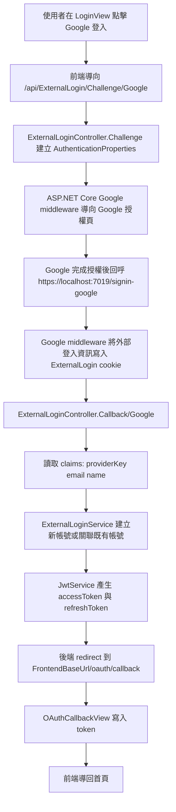
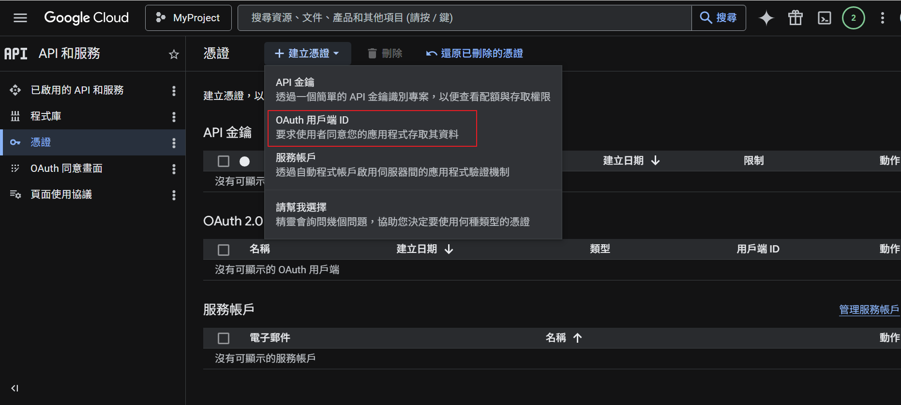
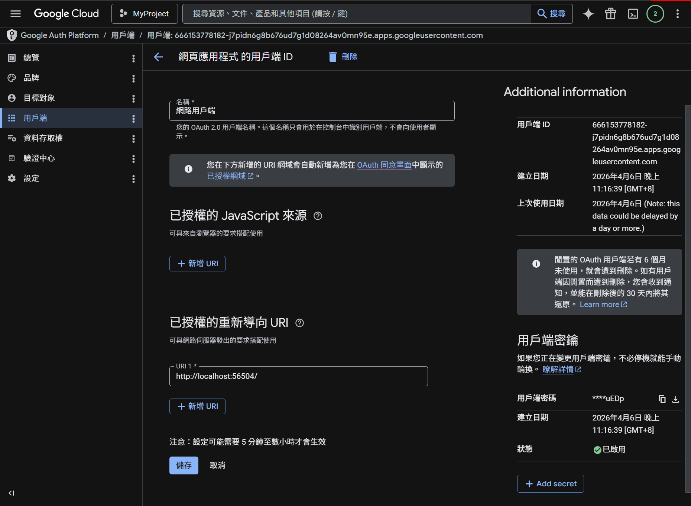
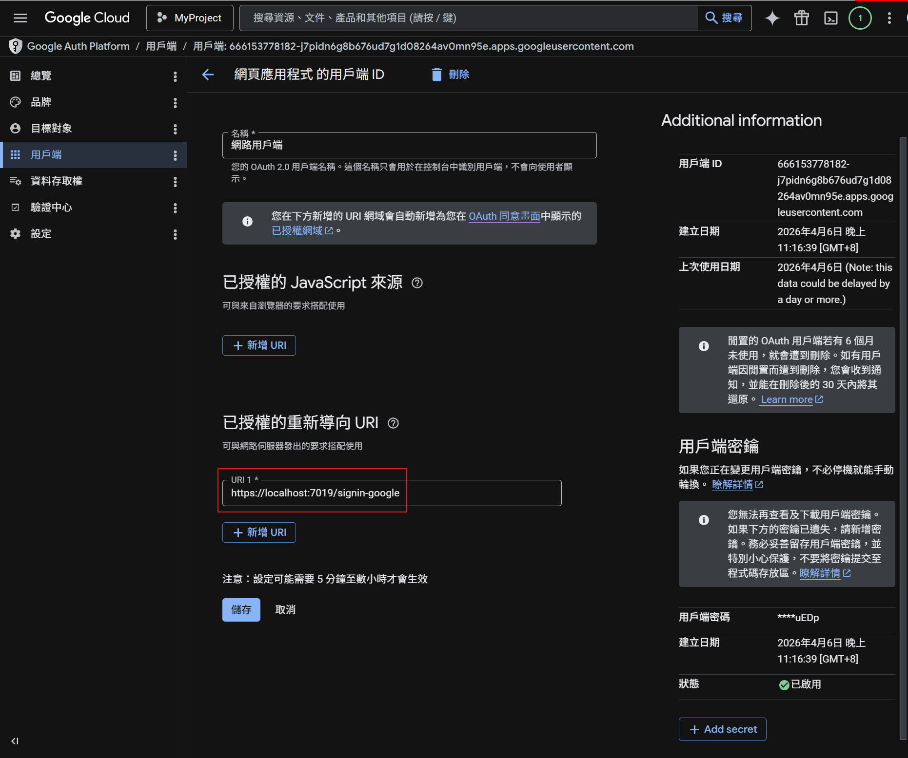

這篇記錄 `Library` 專案的第三方 Google 登入設定流程，包含 Google Cloud Console 建立 OAuth 用戶端、ASP.NET Core 後端設定，以及前端登入頁如何串接 Google 登入。

## 流程圖



## 1. 建立 Google OAuth 用戶端

先到 Google Cloud Console 的 `API 和服務 > 憑證`，建立 `OAuth 用戶端 ID`。



建立完成後，可以在用戶端設定頁面填入重新導向 URI。這裡最重要的是後端 Google middleware 使用的 callback URI。





### URI 設定重點

- `https://localhost:7019/signin-google`
  Google OAuth 完成授權後，會先回到 ASP.NET Core 的 Google middleware。
- `http://localhost:56504/oauth/callback`
  這不是 Google 直接回呼的 URI，而是後端完成 JWT 建立後，再重新導向回前端的頁面。
- `http://localhost:56504/`
  如果你在 Google Cloud Console 有先加入前端網域，也要確認和實際開發網址一致。

## 2. 後端 appsettings 設定

`Library.Server/appsettings.Development.json`

```json
"Authentication": {
  "Google": {
    "ClientId": "",
    "ClientSecret": ""
  }
},
"FrontendBaseUrl": "http://localhost:56504"
```

這裡要填入 Google Cloud Console 產生的 `ClientId` 和 `ClientSecret`。`FrontendBaseUrl` 則是後端在 OAuth 成功後，最後 redirect 回前端 callback 頁使用的網址。

## 3. Program.cs 註冊 Google 登入

`Library.Server/Program.cs`

```csharp
builder.Services.AddAuthentication(options =>
{
    options.DefaultAuthenticateScheme = JwtBearerDefaults.AuthenticationScheme;
    options.DefaultChallengeScheme = JwtBearerDefaults.AuthenticationScheme;
})
.AddJwtBearer(options =>
{
    // 省略 JWT 設定
})
.AddCookie("ExternalLogin", options =>
{
    options.Cookie.SameSite = SameSiteMode.Lax;
})
.AddGoogle(options =>
{
    var googleAuth = builder.Configuration.GetSection("Authentication:Google");
    options.ClientId = googleAuth["ClientId"]!;
    options.ClientSecret = googleAuth["ClientSecret"]!;
    options.SignInScheme = "ExternalLogin";
});
```

這段設定有兩個重點：

1. `.AddCookie("ExternalLogin")` 用來暫存 Google 回傳的外部登入資訊。
2. `options.SignInScheme = "ExternalLogin"` 表示 Google 驗證成功後，先把 claims 寫進這個 cookie，再交給 controller 讀取。

## 4. ExternalLoginController 發起與接收回呼

`Library.Server/Controllers/ExternalLoginController.cs`

```csharp
[HttpGet("Challenge/{provider}")]
public IActionResult Challenge(string provider)
{
    var callbackUrl = Url.Action(nameof(Callback), "ExternalLogin",
        new { provider }, Request.Scheme);

    var properties = new AuthenticationProperties
    {
        RedirectUri = callbackUrl,
        Items = { { "LoginProvider", provider } }
    };

    return Challenge(properties, provider);
}

[HttpGet("Callback/{provider}")]
public async Task<IActionResult> Callback(string provider)
{
    var result = await HttpContext.AuthenticateAsync("ExternalLogin");
    if (!result.Succeeded || result.Principal == null)
    {
        return RedirectToFrontend(error: "授權失敗，請重新登入");
    }

    var claims = result.Principal.Claims.ToList();
    var providerKey = claims.FirstOrDefault(c => c.Type == ClaimTypes.NameIdentifier)?.Value;
    var email = claims.FirstOrDefault(c => c.Type == ClaimTypes.Email)?.Value;
    var name = claims.FirstOrDefault(c => c.Type == ClaimTypes.Name)?.Value;

    await HttpContext.SignOutAsync("ExternalLogin");

    var loginResult = await _externalLoginService.ProcessExternalLoginAsync(
        provider, providerKey!, email, name);

    var accessToken = await _jwtService.GenerateAccessTokenAsync(loginResult.User!);
    var refreshToken = _jwtService.GenerateRefreshToken();

    return RedirectToFrontend(
        accessToken: accessToken,
        refreshToken: refreshToken,
        userName: loginResult.User!.UserName);
}
```

流程是：

1. `Challenge` 先把使用者送到 Google。
2. Google 完成授權後，先回 ASP.NET Core 的 `signin-google`。
3. middleware 把外部登入資訊寫到 `ExternalLogin` cookie。
4. `Callback` 再從 `ExternalLogin` cookie 讀出 claims，交給 service 建立或關聯帳號。
5. 最後建立 JWT，重新導向回前端 `/oauth/callback`。

## 5. ExternalLoginService 建立或關聯帳號

`Zheng.Bll/Services/ExternalLoginService.cs`

```csharp
var externalLogin = await _context.UserExternalLogins
    .Include(e => e.User)
    .FirstOrDefaultAsync(e => e.LoginProvider == loginProvider && e.ProviderKey == providerKey);

if (externalLogin != null)
{
    return new ExternalLoginResult
    {
        Succeeded = true,
        User = externalLogin.User,
        IsNewUser = false
    };
}

var normalizedEmail = email.ToUpperInvariant();
var userByEmail = await _context.Users
    .FirstOrDefaultAsync(u => u.NormalizedEmail == normalizedEmail && u.IsActive);
```

這裡的規則很單純：

- 如果 `UserExternalLogin` 已經有這組 `loginProvider + providerKey`，直接登入。
- 如果還沒有，但系統內已存在相同 email 的使用者，就把 Google 登入關聯到既有帳號。
- 如果連 email 對應的帳號都沒有，就建立新帳號，並自動標記 `EmailConfirmed = true`。

## 6. 前端登入頁發起 Google 登入

`library.client/src/views/LoginView.vue`

```ts
const handleSocialLogin = (provider: string) => {
  socialLoading.value = provider;
  setTimeout(() => {
    window.location.href = `/api/ExternalLogin/Challenge/${provider}`;
  }, 300);
};
```

登入頁的 Google 按鈕會直接導向 `/api/ExternalLogin/Challenge/Google`，由後端接手後續 OAuth 流程。

## 7. 前端 callback 頁接收 token

`library.client/src/views/OAuthCallbackView.vue`

```ts
onMounted(() => {
  const query = route.query;

  if (query.error) {
    error.value = query.error as string;
    return;
  }

  const accessToken = query.accessToken as string;
  const refreshToken = query.refreshToken as string;
  const userName = query.userName as string;

  authStore.setTokensFromOAuth(accessToken, refreshToken, userName);
  router.replace('/');
});
```

後端 callback 成功後，會把 `accessToken`、`refreshToken`、`userName` 帶到前端 `/oauth/callback`。前端只要把 token 存起來，再導回首頁即可。

## 8. 實際驗證方式

1. 啟動 `Library.Server`
2. 啟動前端專案
3. 到登入頁點擊 `Google`
4. 完成 Google 授權
5. 確認瀏覽器回到 `/oauth/callback`
6. 確認前端已寫入 token，並成功進入首頁

## 參考程式位置

- [LibraryDevelop - GitHub](https://github.com/hezhengmin/LibraryDevelop)


