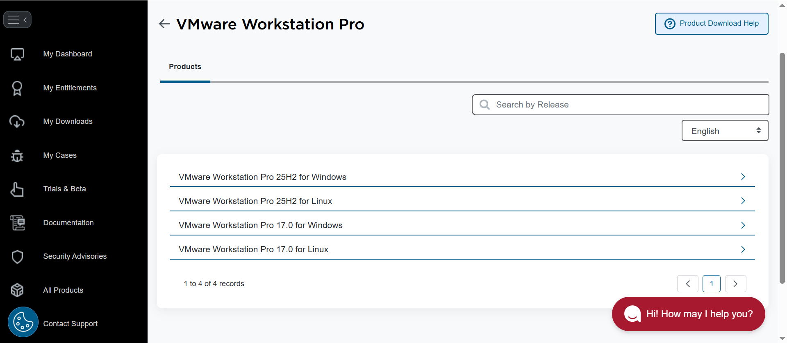
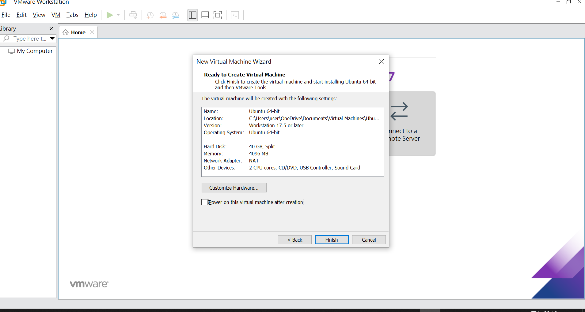
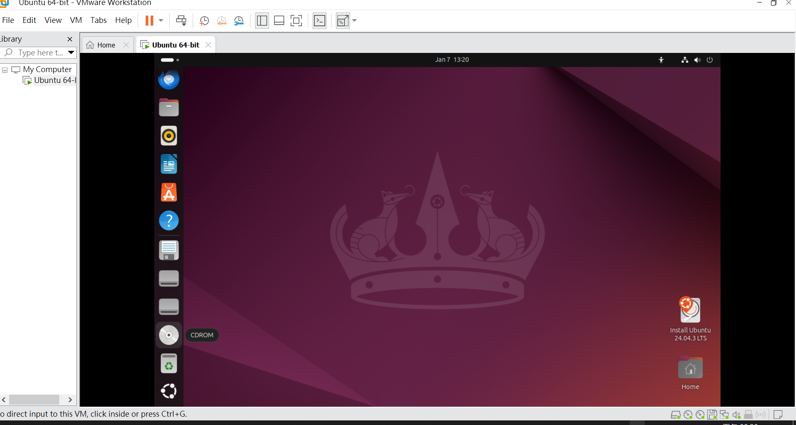
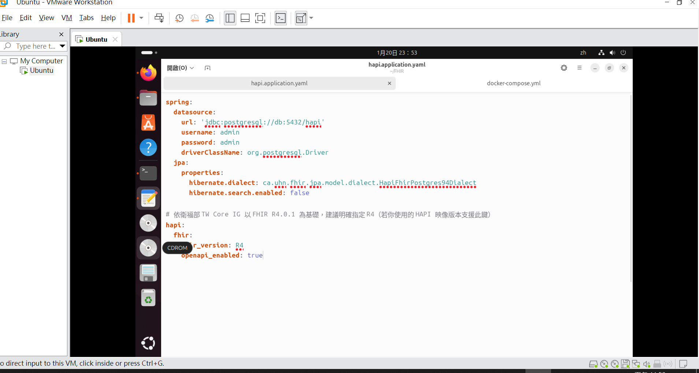
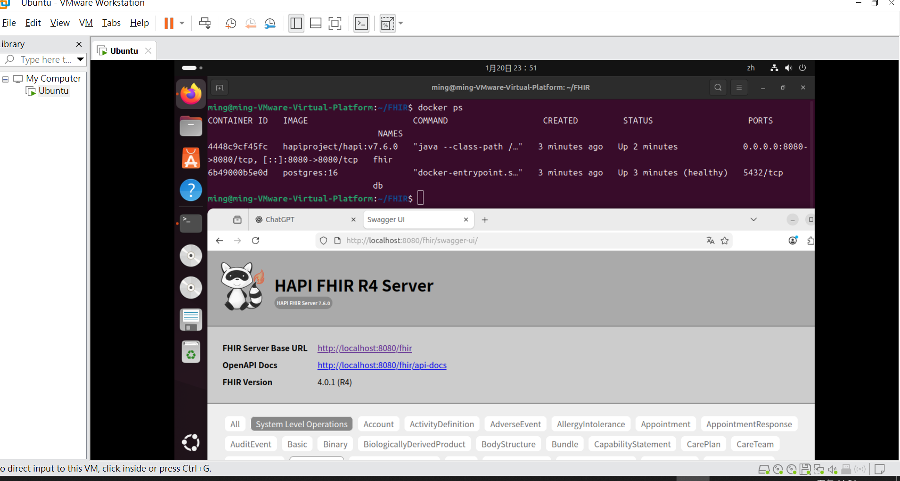

# Windows 安裝 VMware Ubuntu 虛擬機，並用 Docker 架設 HAPI FHIR Server

## 前言

這篇教學整理從 Windows 安裝 VMware Workstation Pro、建立 Ubuntu 虛擬機，到在 Ubuntu 內使用 Docker 架設 HAPI FHIR R4 Server 的完整流程。

本文以本機開發與測試為目標，最後會讓你在瀏覽器中開啟：

- `http://localhost:8080/fhir`
- `http://localhost:8080/fhir/swagger-ui/`

## 環境需求

- Windows 電腦
- VMware Workstation Pro
- Ubuntu ISO 映像檔
- 可連線網路
- 至少 `4 GB` 可分配記憶體
- 至少 `40 GB` 可用磁碟空間

本文使用的虛擬機與服務配置如下：

- VM 記憶體：`4 GB`
- CPU：`2 cores`
- 磁碟：`40 GB`
- 網路：`NAT`
- HAPI FHIR：`hapiproject/hapi:v7.6.0`
- PostgreSQL：`postgres:16`
- FHIR 版本：`R4`

## Step 1 安裝 VMware Workstation Pro

1. 到 VMware Workstation Pro 下載頁下載 Windows 安裝程式。
2. 安裝完成後啟動 VMware Workstation。

如果你下載的是下列檔名，代表和本文範例相同版本：

```text
VMware-workstation-full-17.6.4-24832109.exe
```



## Step 2 建立 Ubuntu 64-bit 虛擬機

1. 在 VMware 中建立新的虛擬機。
2. 選擇 Ubuntu 64-bit。
3. 指定 Ubuntu ISO。
4. 建議設定如下：

```text
Name: Ubuntu 64-bit
Memory: 4096 MB
Processors: 2
Hard Disk: 40 GB
Network Adapter: NAT
```

5. 完成精靈後建立虛擬機。
6. 若有看到 `Power on this virtual machine after creation`，可勾選直接開機。



## Step 3 啟動 Ubuntu 並確認基本環境

1. 啟動虛擬機。
2. 進入 Ubuntu 桌面。
3. 開啟 Terminal。
4. 先更新套件清單：

```bash
sudo apt update
```

5. 確認系統網路正常：

```bash
ip a
```

如果有看到虛擬機取得 IP，例如 `192.168.x.x`，通常表示網路正常。



## Step 4 安裝 Docker

本文依照你的成功畫面，採用 Ubuntu 內可正常執行的 Docker 環境。

### 方式一：使用 snap 安裝

```bash
sudo snap install docker
```

安裝完成後可用以下指令檢查版本：

```bash
docker --version
docker info
```

### 如果出現 Docker 權限錯誤

你可能會遇到類似下列訊息：

```text
permission denied while trying to connect to the Docker daemon socket
```

先用 `sudo` 測試：

```bash
sudo docker ps
```

若確認 Docker 正常，再把目前使用者加入 docker 群組：

```bash
sudo usermod -aG docker $USER
newgrp docker
```

然後重新登入或重開 Terminal 後再測試：

```bash
docker ps
```

## Step 5 準備 FHIR 專案目錄

先建立一個專案資料夾，例如：

```bash
mkdir -p ~/FHIR
cd ~/FHIR
```

接著建立 `docker-compose.yml`：

```yaml
services:
  fhir:
    container_name: fhir
    image: "hapiproject/hapi:v7.6.0"
    ports:
      - "8080:8080"
    depends_on:
      db:
        condition: service_healthy
    configs:
      - source: hapi
        target: /app/config/application.yaml
    restart: unless-stopped

  db:
    container_name: db
    image: "postgres:16"
    environment:
      POSTGRES_PASSWORD: admin
      POSTGRES_USER: admin
      POSTGRES_DB: hapi
    volumes:
      - hapi_postgres_data:/var/lib/postgresql/data
    healthcheck:
      test: ["CMD-SHELL", "pg_isready -U admin -d hapi"]
      interval: 10s
      timeout: 5s
      retries: 10
    restart: unless-stopped

configs:
  hapi:
    file: ./hapi.application.yaml

volumes:
  hapi_postgres_data:
```

## Step 6 建立 HAPI FHIR 設定檔

在同一個資料夾建立 `hapi.application.yaml`：

```yaml
spring:
  datasource:
    url: 'jdbc:postgresql://db:5432/hapi'
    username: admin
    password: admin
    driverClassName: org.postgresql.Driver
  jpa:
    properties:
      hibernate.dialect: ca.uhn.fhir.jpa.model.dialect.HapiFhirPostgres94Dialect
      hibernate.search.enabled: false

hapi:
  fhir:
    fhir_version: R4
    openapi_enabled: true
```

這份設定代表：

- HAPI FHIR 連線到 Compose 內的 PostgreSQL 服務 `db`
- 資料庫名稱是 `hapi`
- 帳號密碼是 `admin / admin`
- 啟用 `R4`
- 啟用 OpenAPI 與 Swagger UI

下圖是成功啟動後使用的 `hapi.application.yaml` 設定畫面：



## Step 7 啟動容器

在 `~/FHIR` 目錄執行：

```bash
docker compose up -d
```

如果你的環境仍使用舊版 Compose 指令，也可以改用：

```bash
docker-compose up -d
```

第一次啟動會下載映像，時間會比較久。

啟動後檢查容器狀態：

```bash
docker ps
```

理想情況下會看到：

- `db` 容器狀態為 `healthy`
- `fhir` 容器狀態為 `Up`
- `fhir` 對外開放 `8080`



## Step 8 驗證 HAPI FHIR 是否成功

在 Ubuntu 內或 Windows 主機瀏覽器打開：

```text
http://localhost:8080/fhir
http://localhost:8080/fhir/swagger-ui/
```

如果成功，你應該會看到：

- `HAPI FHIR R4 Server`
- FHIR Base URL 顯示為 `http://localhost:8080/fhir`
- OpenAPI Docs 可正常點開

## 常用指令

### 查看容器狀態

```bash
docker ps
docker ps -a
```

### 查看容器日誌

```bash
docker logs fhir
docker logs db
```

### 停止服務

```bash
docker compose down
```

### 重新啟動服務

```bash
docker compose up -d
```

## 常見問題

### 1. `docker ps` 出現 permission denied

表示目前使用者沒有權限連 Docker daemon。

可先使用：

```bash
sudo docker ps
```

之後再把使用者加入 docker 群組：

```bash
sudo usermod -aG docker $USER
newgrp docker
```

### 2. PostgreSQL 一直重啟或不健康

先查看日誌：

```bash
docker logs db
```

再確認 `docker-compose.yml` 中這幾個值一致：

- `POSTGRES_USER: admin`
- `POSTGRES_PASSWORD: admin`
- `POSTGRES_DB: hapi`

也要確認 `hapi.application.yaml` 中連線字串與帳密一致：

```yaml
url: 'jdbc:postgresql://db:5432/hapi'
username: admin
password: admin
```

### 3. HAPI FHIR 容器沒有起來

先查看日誌：

```bash
docker logs fhir
```

常見原因：

- PostgreSQL 尚未 healthy
- `hapi.application.yaml` 格式錯誤
- `8080` 埠已被其他服務占用

可先確認埠映射是否正確：

```yaml
ports:
  - "8080:8080"
```

### 4. Compose 提示 `version` 欄位 obsolete

如果你曾經使用舊範例，可能會看到：

```text
the attribute `version` is obsolete
```

新版本 Compose 可以直接省略 `version` 欄位，本文範例已移除。

## 完成

完成以上步驟後，你就已經在 Ubuntu 虛擬機中用 Docker 成功架起 HAPI FHIR Server。

後續可以再擴充：

- 匯入 FHIR 測試資料
- 串接自己的 TW Core Profile
- 在前面加 Nginx 或反向代理
- 改成正式環境資料庫與持久化配置

