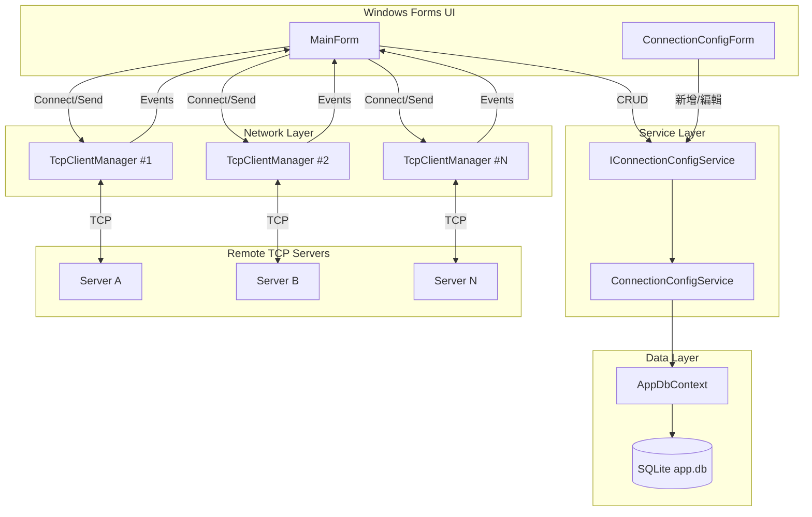

## 前言

在工業自動化、物聯網或測試平台等場景中，常常需要同時維護多條 TCP 長連線，並即時監控各連線的狀態與收發訊息。手動管理多個 `TcpClient` 實例、確保 UI 執行緒安全、避免競態條件（Race Condition）——這些問題加在一起很快就會讓程式碼難以維護。

**SocketReceiver** 就是為了解決這個問題而誕生的：一款以 C# / .NET 10 撰寫的 Windows Forms 桌面工具，讓使用者透過圖形介面管理多組 TCP 連線組態、一鍵全部連線、廣播訊息，並即時查看日誌。

---

## 功能概覽

| 功能 | 說明 |
|------|------|
| **組態管理** | 新增、編輯、刪除 TCP 端點，支援啟用/停用個別連線 |
| **連線管理** | 單一連線、全部連線、全部斷線，啟動時自動連線已啟用的端點 |
| **狀態監控** | DataGridView 即時顯示每條連線的狀態（待機/連線中/已連線/錯誤） |
| **訊息收發** | 廣播文字訊息至所有已連線的端點，並接收伺服器回傳資料 |
| **持久化儲存** | 組態存入 SQLite，應用程式重啟後自動還原 |

---

## 技術架構

### Tech Stack

| 項目 | 技術 |
|------|------|
| 語言 | C# 13 / .NET 10 |
| UI 框架 | Windows Forms |
| ORM | Entity Framework Core 10 |
| 資料庫 | SQLite (`%LOCALAPPDATA%\SocketReceiver\app.db`) |
| 非同步模型 | Task-based async/await |
| 解決方案格式 | `.slnx`（Visual Studio 2022+） |

### 架構圖



---

## 主要功能介紹

### 1. 連線組態 CRUD

每條 TCP 連線以 `TcpConnectionConfig` 實體表示，透過 `IConnectionConfigService` 進行操作。

```csharp
// Models/TcpConnectionConfig.cs
public class TcpConnectionConfig
{
    public int Id { get; set; }
    public string Name { get; set; }        // 唯一，最多 100 字
    public string IpAddress { get; set; }  // 最多 45 字（支援 IPv6）
    public int Port { get; set; }
    public bool IsEnabled { get; set; }    // 是否納入「全部連線」
    public string Description { get; set; }
    public DateTime CreatedAt { get; set; }
    public DateTime UpdatedAt { get; set; }
}
```

Service 層在新增/更新時會驗證名稱與端點（IP + Port）的唯一性，避免重複連線到同一個伺服器：

```csharp
// Services/ConnectionConfigService.cs
public async Task<bool> IsEndpointAvailableAsync(string ip, int port, int? excludeId = null)
{
    return !await _db.ConnectionConfigs
        .Where(c => excludeId == null || c.Id != excludeId)
        .AnyAsync(c => c.IpAddress == ip && c.Port == port);
}
```

資料庫層透過 EF Core Fluent API 設定複合唯一索引：

```csharp
// Data/AppDbContext.cs
modelBuilder.Entity<TcpConnectionConfig>(entity =>
{
    entity.HasIndex(e => e.Name).IsUnique();
    entity.HasIndex(e => new { e.IpAddress, e.Port }).IsUnique();
});
```

---

### 2. 連線管理與競態條件防護

`MainForm` 持有一個 `_lock` 物件，搭配「slot reservation」模式來防止同一個端點被重複連線：

```csharp
// MainForm.cs（簡化）
private readonly object _lock = new();
private readonly Dictionary<int, TcpClientManager> _activeClients = new();
private readonly Dictionary<int, ConnectionStatus> _connectionStatus = new();

private async Task ConnectAsync(TcpConnectionConfig config)
{
    lock (_lock)
    {
        // 若已連線或正在連線中，直接跳出
        if (_connectionStatus.TryGetValue(config.Id, out var status) &&
            status is ConnectionStatus.Connected or ConnectionStatus.Connecting)
            return;

        // 提前佔位，防止其他執行緒同時進入
        _connectionStatus[config.Id] = ConnectionStatus.Connecting;
    }

    var client = new TcpClientManager(config);
    // 訂閱事件...
    await client.ConnectAsync();
}
```

「全部連線」功能則並行啟動所有已啟用的連線：

```csharp
var enabledConfigs = await _configService.GetEnabledAsync();
var tasks = enabledConfigs.Select(c => ConnectAsync(c));
await Task.WhenAll(tasks);
```

---

### 3. 連線狀態視覺化

`ConnectionStatus` 列舉對應到 DataGridView 上的視覺符號，讓使用者一眼辨別連線狀態：

```csharp
public enum ConnectionStatus
{
    Idle,        // — 待機
    Connecting,  // ◌ 連線中
    Connected,   // ● 已連線
    Disconnected,// ○ 已斷線
    Error        // ✕ 錯誤
}
```

由於連線是在背景執行緒完成的，UI 更新必須透過 `Invoke` 回到 UI 執行緒：

```csharp
private void UpdateStatusUI(int configId, ConnectionStatus status)
{
    if (dataGridView.InvokeRequired)
    {
        dataGridView.Invoke(() => UpdateStatusUI(configId, status));
        return;
    }
    // 更新 DataGridView 對應列的狀態欄位
}
```

---

### 4. 事件驅動的 TcpClientManager

`TcpClientManager` 封裝了 `TcpClient`，透過事件將網路活動通知 `MainForm`，保持關注點分離：

```csharp
// TcpClientManager.cs
public event Action<string, string>? OnMessageReceived;  // (name, data)
public event Action<string, string>? OnMessageSend;
public event Action<string, string>? OnMessageError;
public event Action<string>?         OnMessageConnect;
public event Action<string>?         OnDisconnected;

public async Task ConnectAsync()
{
    _client = new TcpClient();
    await _client.ConnectAsync(_config.IpAddress, _config.Port, _cts.Token);
    OnMessageConnect?.Invoke(_config.Name);
    _ = ReadLoopAsync();  // 在背景持續讀取
}

private async Task ReadLoopAsync()
{
    var buffer = new byte[65536];
    var stream = _client.GetStream();
    while (!_cts.Token.IsCancellationRequested)
    {
        int bytesRead = await stream.ReadAsync(buffer, _cts.Token);
        if (bytesRead == 0) break;  // 伺服器關閉連線
        var message = Encoding.UTF8.GetString(buffer, 0, bytesRead);
        OnMessageReceived?.Invoke(_config.Name, message);
    }
}
```

---

### 5. 結構化日誌

RichTextBox 日誌使用統一格式，讓訊息易於辨識：

```
[14:32:01] [Server-A][系統] 連線成功
[14:32:05] [Server-A][接收] {"status":"ok","value":42}
[14:32:10] [Server-A][傳送] ping
[14:32:15] [Server-A][錯誤] 連線中斷：遠端主機強制關閉連線
```

類別包含：`[接收]`、`[傳送]`、`[系統]`、`[錯誤]`，並搭配自動捲動與清除按鈕。

---

## 資料持久化設計

組態資料存放於 SQLite，路徑為 `%LOCALAPPDATA%\SocketReceiver\app.db`，確保不需要安裝資料庫服務。應用程式啟動時自動執行 EF Core Migration：

```csharp
// Program.cs
var factory = new AppDbContextFactory();
using var db = factory.CreateDbContext([]);
await db.Database.MigrateAsync();  // 自動建立或升級 schema
```

`AppDbContextFactory` 負責依環境組裝連線字串，與 DbContext 本身解耦：

```csharp
// Data/AppDbContextFactory.cs
public AppDbContext CreateDbContext(string[] args)
{
    var appData = Environment.GetFolderPath(Environment.SpecialFolder.LocalApplicationData);
    var dbPath = Path.Combine(appData, "SocketReceiver", "app.db");
    Directory.CreateDirectory(Path.GetDirectoryName(dbPath)!);

    var options = new DbContextOptionsBuilder<AppDbContext>()
        .UseSqlite($"Data Source={dbPath}")
        .Options;

    return new AppDbContext(options);
}
```

---

## 總結

SocketReceiver 示範了幾個在 Windows Forms 應用中常被忽略的工程細節：

- **Thread-safe UI 更新**：所有來自背景執行緒的 UI 操作都透過 `InvokeRequired` 模式處理。
- **Race condition 防護**：在 lock 區塊內提前設定狀態（slot reservation），避免重複連線。
- **關注點分離**：`TcpClientManager` 只負責網路通訊並以事件對外通知，`MainForm` 只負責協調 UI 與業務邏輯，`ConnectionConfigService` 只負責資料存取。
- **零依賴部署**：SQLite 內嵌於應用程式，不需要額外安裝資料庫。

如果你也在開發需要管理多條 TCP 連線的桌面工具，這個專案的架構或許可以作為參考起點。
