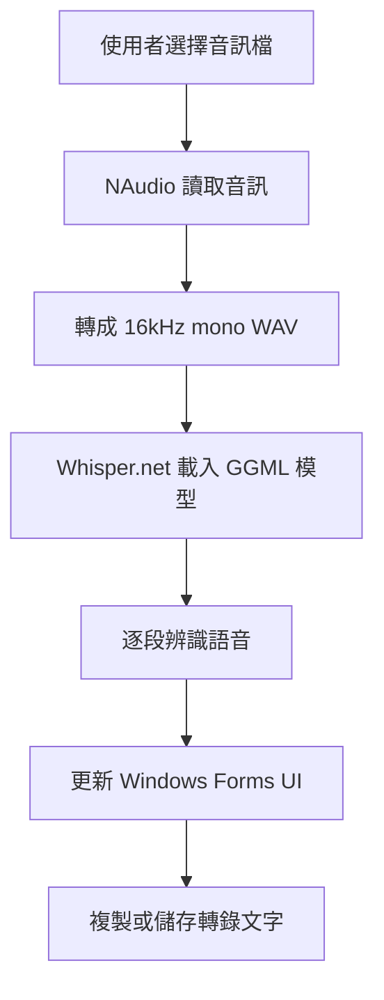

## 前言

語音轉文字已經是很常見的 AI 應用，但如果每次都要把錄音檔上傳到雲端服務，對於會議紀錄、訪談、課程錄音或內部資料來說，仍然會有隱私與網路依賴的問題。

**AudioTranscriber** 是一個用 C# / .NET 9 寫成的 Windows Forms 桌面工具，目標很單純：把錄音檔丟進視窗，選擇模型，直接在本機完成語音辨識。整個辨識流程透過 Whisper.net 執行，不需要把音訊送到外部 API。

這個專案除了支援一般 Whisper GGML 模型，也嘗試把 MediaTek Research 的 **Breeze ASR 25** 轉成 Whisper.net 可讀取的 GGML 格式，讓繁體中文語音辨識有更好的模型選項。

---

## 功能概覽

| 功能 | 說明 |
|------|------|
| **拖放音訊檔** | 可將錄音檔拖曳到視窗，或點擊區塊選擇檔案 |
| **多格式支援** | 支援 M4A、AAC、WAV、MP3、FLAC |
| **模型選擇** | 可選 Base、Small、Breeze ASR 25 |
| **離線轉錄** | 使用 Whisper.net 在本機載入 GGML 模型進行辨識 |
| **轉錄控制** | 支援開始、取消、進度狀態顯示 |
| **結果輸出** | 可複製文字，或另存成 UTF-8 文字檔 |

介面上刻意維持簡單流程：

1. 拖曳或選擇音訊檔。
2. 選擇 Whisper 模型。
3. 按下「開始轉錄」。
4. 等待結果逐段顯示在文字區。
5. 複製或另存結果。

---

## 技術架構

### Tech Stack

| 項目 | 技術 |
|------|------|
| 語言 | C# / .NET 9 |
| UI 框架 | Windows Forms |
| 語音辨識 | Whisper.net |
| 音訊處理 | NAudio |
| 模型格式 | GGML |
| 目標平台 | Windows |

整體流程如下：



AudioTranscriber 的核心不是複雜架構，而是把幾個實用環節串好：

- 音訊格式統一
- 模型檔案管理
- 背景執行辨識
- UI thread 安全更新
- 轉錄結果輸出

---

## 音訊處理流程

Whisper 模型通常需要特定格式的音訊輸入。專案中先用 NAudio 讀取使用者選擇的檔案，再轉成 `16kHz`、`16-bit`、`mono` 的 WAV 暫存檔：

```csharp
private static void ConvertToWav(string inputPath, string outputPath)
{
    using var reader = new MediaFoundationReader(inputPath);
    var targetFormat = new WaveFormat(16000, 16, 1);
    using var resampler = new MediaFoundationResampler(reader, targetFormat)
    {
        ResamplerQuality = 60
    };
    WaveFileWriter.CreateWaveFile(outputPath, resampler);
}
```

這樣做有兩個好處：

- UI 可以接受常見錄音格式，不需要使用者手動轉檔。
- Whisper.net 後面的處理流程固定吃 WAV，降低模型辨識時的格式變數。

暫存檔會放在系統 temp 目錄，轉錄完成或發生錯誤後再刪除，避免使用者目錄被中間檔污染。

---

## 模型選擇設計

目前介面提供三種模型選項：

| 模型 | 說明 |
|------|------|
| Base | 基礎模型，速度較快 |
| Small | 小型模型，準確度較高 |
| Breeze ASR 25 | 繁中優化模型，準確度最高，但需自行準備 GGML 檔 |

程式會依照下拉選單決定模型檔名：

```csharp
string modelFileName = cmbModel.SelectedIndex switch
{
    0 => "ggml-base.bin",
    2 => "ggml-breeze-asr-25.bin",
    _ => "ggml-small.bin"
};
```

Base 與 Small 如果不存在，會透過 Whisper.net 下載：

```csharp
using var modelStream = await WhisperGgmlDownloader.GetGgmlModelAsync(modelType);
await using var fileStream = File.Create(modelPath);
await modelStream.CopyToAsync(fileStream);
```

Breeze ASR 25 則不同。它不是 Whisper.net 內建可下載的模型，因此必須先透過轉換腳本產生 `ggml-breeze-asr-25.bin`，再放到執行檔同一層目錄。

---

## 使用 Whisper.net 進行辨識

轉檔完成後，程式使用 Whisper.net 從 GGML 模型建立 processor，並指定辨識語言為中文：

```csharp
using var factory = WhisperFactory.FromPath(modelPath);
await using var processor = factory.CreateBuilder()
    .WithLanguage("zh")
    .Build();
```

接著把 WAV stream 丟進 `ProcessAsync`，逐段取得辨識結果：

```csharp
await using var wavStream = File.OpenRead(wavPath);
await foreach (var segment in processor.ProcessAsync(wavStream, ct))
{
    string text = segment.Text;
    this.Invoke(() =>
    {
        rtbResult.AppendText(text);
        rtbResult.ScrollToCaret();
    });
}
```

這裡有一個 Windows Forms 常見細節：辨識是在背景工作中執行，但 `RichTextBox` 必須回到 UI thread 才能更新。因此每次取得 segment 後，會透過 `Invoke` 把文字附加到畫面上。

取消功能則透過 `CancellationTokenSource` 處理：

```csharp
private void btnCancel_Click(object? sender, EventArgs e)
{
    _cts?.Cancel();
    toolStripStatus.Text = "正在取消...";
}
```

這讓長音檔或大型模型載入時，使用者不需要強制關閉程式。

---

## Breeze ASR 25 轉成 GGML

AudioTranscriber 比較特別的地方，是加入了 Breeze ASR 25 模型的支援。

原始模型來自 HuggingFace，權重是 safetensors 格式，資料精度是 BF16。Whisper.net 則需要能被 whisper.cpp / GGML 生態讀取的模型檔，因此中間要做一次格式轉換：

```text
HuggingFace safetensors
        |
        | 讀取 BF16 權重
        v
Python 轉換腳本
        |
        | BF16 -> F32 -> F16
        v
ggml-breeze-asr-25.bin
        |
        v
Whisper.net
```

### 為什麼不用 PyTorch 直接載入？

一開始嘗試過幾種方式：

| 方法 | 問題 |
|------|------|
| `WhisperForConditionalGeneration.from_pretrained()` | Windows 上載入大型模型時可能崩潰 |
| `safetensors.safe_open(..., framework="numpy")` | 不支援 BF16 dtype |
| `safetensors.safe_open(..., framework="pt")` | PyTorch mmap 在 Windows 上可能觸發 Access Violation |

最後採用比較直接但穩定的方式：不用 safetensors 函式庫，也不靠 PyTorch，而是用 Python 標準檔案 API 讀取 safetensors header，再依照每個 tensor 的 byte offset 逐一 `seek()` 讀取。

簡化後的概念如下：

```python
with open("model.safetensors", "rb") as f:
    header_len = struct.unpack("<Q", f.read(8))[0]
    st_header = json.loads(f.read(header_len))
    data_start = 8 + header_len
```

之後每次只讀一個 tensor：

```python
with open("model.safetensors", "rb") as sf:
    for src_name, info in st_header.items():
        off0, off1 = info["data_offsets"]
        sf.seek(data_start + off0)
        raw = sf.read(off1 - off0)
        data = bf16_bytes_to_f32(raw).astype(np.float16)
        # 寫入 GGML...
        del raw, data
```

這樣不需要一次把整個 3GB 模型載入記憶體，轉換過程比較能在一般 Windows 開發機上完成。

---

## BF16 到 F16 的轉換

Breeze ASR 25 的權重是 BF16，但 GGML 主要使用 F16。兩者雖然都是 16-bit 浮點格式，但位元配置不同，不能直接把 bytes 當成 F16 解讀。

轉換流程是：

```text
BF16 -> F32 -> F16
```

其中 BF16 轉 F32 的關鍵是把 16-bit 資料左移到 F32 的高 16 位元：

```python
def bf16_bytes_to_f32(raw_bytes: bytes) -> np.ndarray:
    u16 = np.frombuffer(raw_bytes, dtype=np.uint16)
    u32 = u16.astype(np.uint32) << 16
    return u32.view(np.float32)
```

原因是 BF16 和 F32 的 exponent 都是 8 bits。把 BF16 左移後，符號位與 exponent 會對齊 F32 的位置，mantissa 剩下的低位補 0，再交給 numpy 重新解讀成 `float32`。

接著再轉成 `float16`：

```python
data = bf16_bytes_to_f32(raw_bytes).astype(np.float16)
```

---

## 張量名稱映射

HuggingFace Transformers 的 tensor 命名方式和 whisper.cpp / GGML 使用的命名不同，因此轉換時也要做名稱映射。

例如：

| HuggingFace | GGML |
|-------------|------|
| `model.encoder.layers.0.self_attn.q_proj.weight` | `encoder.blocks.0.attn.query.weight` |
| `model.encoder.layers.0.self_attn.k_proj.weight` | `encoder.blocks.0.attn.key.weight` |
| `model.decoder.layers.0.encoder_attn.v_proj.weight` | `decoder.blocks.0.cross_attn.value.weight` |
| `model.encoder.layer_norm.weight` | `encoder.ln_post.weight` |
| `model.decoder.embed_tokens.weight` | `decoder.token_embedding.weight` |

幾個主要規則：

- `layers` 轉成 `blocks`
- `self_attn.q_proj` 轉成 `attn.query`
- `self_attn.k_proj` 轉成 `attn.key`
- `encoder_attn.*` 轉成 `cross_attn.*`
- `final_layer_norm` 轉成 `mlp_ln`

這一段是轉換腳本最需要小心的地方。模型權重本身即使讀取成功，只要 tensor 名稱或 shape 寫錯，Whisper.net 載入時仍然會失敗，或在辨識時得到不正確的結果。

---

## GGML 檔案內容

轉換後的 `ggml-breeze-asr-25.bin` 會包含：

- GGML magic number
- Whisper 模型超參數
- Mel filter bank
- vocabulary
- tensor metadata
- tensor binary data

其中超參數大致如下：

```text
vocab_size = 51865
audio_ctx = 1500
d_model = 1280
enc_heads = 20
enc_layers = 32
max_len = 448
dec_heads = 20
dec_layers = 32
n_mels = 80
ftype = 1
```

轉換完成後，也會檢查 magic number 與主要超參數，確認輸出的檔案符合 Whisper large-v2 類型架構。

---

## 使用者體驗上的幾個細節

### 1. 缺少模型時給明確提示

如果使用者選擇 Breeze ASR 25，但執行目錄找不到 `ggml-breeze-asr-25.bin`，程式不會直接丟例外，而是顯示下一步該怎麼做：

```text
請先執行轉換腳本產生 GGML 格式模型：
1. 安裝 Python 套件
2. 執行 convert_breeze_asr.py
3. 將 ggml-breeze-asr-25.bin 放到執行檔目錄
```

這對桌面工具很重要。模型檔通常很大，不適合直接包進 Git repository，也不一定適合跟執行檔一起發佈，所以缺檔時要把處理方式講清楚。

### 2. 轉錄期間鎖定操作

開始轉錄後，程式會停用拖放區、模型選單與開始按鈕，只留下取消功能：

```csharp
private void SetBusy(bool busy)
{
    btnTranscribe.Enabled = !busy;
    pnlDrop.Enabled = !busy;
    cmbModel.Enabled = !busy;
    btnCancel.Enabled = busy;
    progressBar.Style = busy
        ? ProgressBarStyle.Marquee
        : ProgressBarStyle.Continuous;
}
```

這可以避免使用者在模型辨識中途切換檔案或切換模型，造成狀態混亂。

### 3. 結果直接可複製與另存

轉錄完的文字可以直接複製到剪貼簿：

```csharp
Clipboard.SetText(rtbResult.Text);
```

也可以另存成 UTF-8 文字檔：

```csharp
File.WriteAllText(dlg.FileName, rtbResult.Text, System.Text.Encoding.UTF8);
```

對會議記錄、訪談逐字稿、課程筆記這類情境來說，這比只顯示在畫面上實用得多。

---
 
## 參考連結

- [AudioTranscriber GitHub Repository](https://github.com/hezhengmin/AudioTranscriber)
- [MediaTek Research Breeze ASR 25 - Hugging Face](https://huggingface.co/MediaTek-Research/Breeze-ASR-25)

---

## 總結

AudioTranscriber 是一個很典型但實用的本機 AI 工具：用 Windows Forms 做簡單介面，用 NAudio 處理音訊格式，用 Whisper.net 執行離線語音辨識，再補上模型管理、取消、複製、另存等桌面工具需要的細節。

這個專案最有價值的地方不只是在「呼叫 Whisper.net」，而是把 Breeze ASR 25 這類 HuggingFace 模型轉成 Whisper.net 可用的 GGML 格式。轉換過程處理了 safetensors、BF16、F16、tensor name mapping、Windows 大檔讀取等問題，讓繁體中文 ASR 模型可以被整合進一般 C# 桌面應用。

如果要繼續擴充，後續可以考慮：

- 加入時間戳輸出
- 支援 SRT / VTT 字幕格式
- 顯示逐段辨識結果與時間範圍
- 加入批次轉錄
- 記住上次使用的模型與輸出資料夾

對需要在 Windows 上做離線語音辨識的情境來說，這個專案已經是一個可以繼續延伸的基礎版本。
