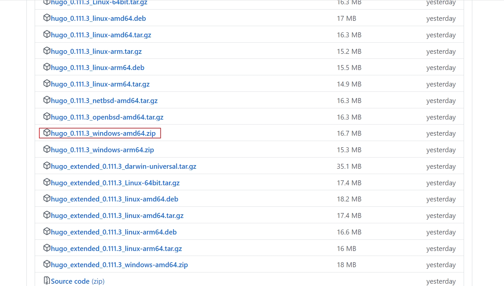
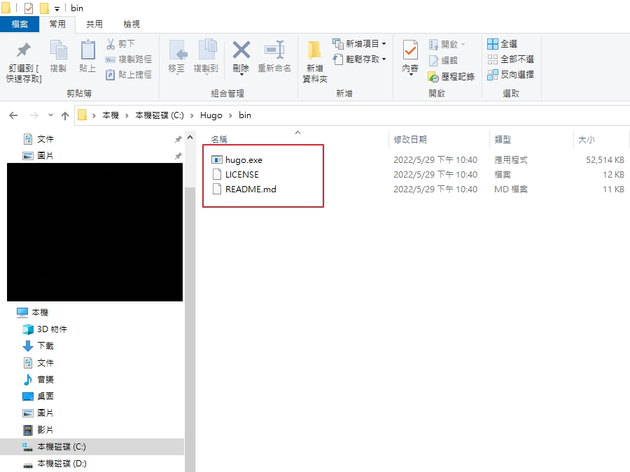
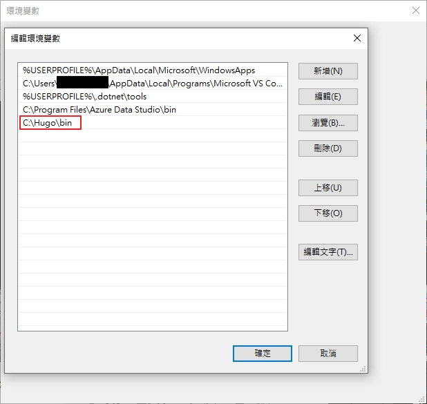

## 安裝 Hugo
官方提供 [Hugo安裝路徑](https://github.com/gohugoio/hugo/releases)


## 設定環境變數


## 創建新站點
```
確認有無安裝hugo
hugo version
建立
hugo new site quickstart
```

## 添加主題
```
cd quickstart
git init
git submodule add https://github.com/theNewDynamic/gohugo-theme-ananke.git themes/ananke
```

## 添加一些內容
```
hugo new posts/my-first-post.md

例如
D:\Github\Hugo\quickstart> hugo new posts/202303191040.md
```

## 啟動 Hugo 服務器
```
hugo server -D
```
## 構建靜態頁面
```
hugo -D
cd public
file_server .

git init
git remote add origin https://github.com/hezhengmin/hezhengmin.github.io.git
git add -A
git commit -m "init site"
git push origin master
```


## 開啟http://localhost:1313/ 測試網站
```
PS D:\Github\Hugo> cd quickstart
PS D:\Github\Hugo\quickstart> hugo server -D
```


## 參考
1. https://gohugo.io/getting-started/quick-start/
2. https://www.youtube.com/watch?v=BRQcD6po5MA


